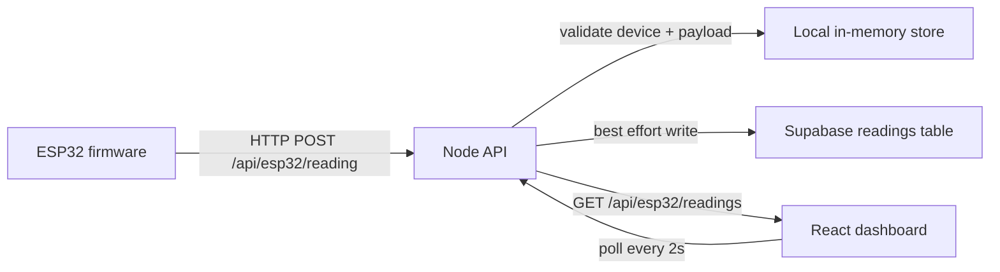
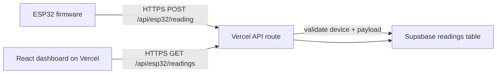

# ESP32 Float Data API + Dashboard

Node.js + Express API for receiving float sensor readings from an ESP32, plus a React dashboard for visualization.

## Architecture

The runtime is split into small modules:

- `server.js` boots the app, serves the dashboard build when present, and starts the HTTP listener.
- `app.js` creates the Express app and wires the routes.
- `routes/esp32.js` owns the ESP32 ingestion and readings endpoints.
- `middleware/require-api-key.js` validates device credentials.
- `lib/reading-store.js` keeps local readings in memory and validates payloads.
- `lib/config.js` parses environment variables and validates the device key map.
- `lib/supabase.js` talks to Supabase through the REST API.

## Endpoint

- Method: POST
- Path: /api/esp32/reading
- Content-Type: application/json
- Authentication: required per-device credentials via headers `x-device-id` and `x-api-key`

## API Key Setup

Use a `.env` file in the project root to store per-device keys (maximum 5 ESP32 devices).

Create `.env` (or copy from `.env.example`) with:

```bash
ESP32_DEVICE_KEYS={"esp32-1":"key-for-device-1","esp32-2":"key-for-device-2"}
```

Then start the API normally:

```bash
npm start
```

If `ESP32_DEVICE_KEYS` is missing, invalid, empty, or has more than 5 devices, the server exits on startup.

Required request headers for ingestion:

- `x-device-id`: the configured device ID (for example `esp32-1`)
- `x-api-key`: API key matching that device ID

`Authorization: Bearer <key>` is also accepted for the key, but `x-device-id` is still required.

## Ingestion Protection

- Rate limit on POST /api/esp32/reading: 60 requests per IP per 10 seconds
- JSON body size limit: 16 KB

When a client exceeds the rate limit, the API responds with HTTP 429 and:

```json
{
	"success": false,
	"error": "Too many readings received. Slow down and retry shortly."
}
```

## Expected Request Body

```json
{
	"title": "Water Temperature",
	"value": 23.78
}
```

- title: required, non-empty string label for the reading
- value: required, float number (for example temperature, pressure, vibration, etc.)

## Readings Feed Endpoint

- Method: GET
- Path: /api/esp32/readings

Returns the latest readings first, with the latest reading also provided separately.

## Response Examples

Success (200):

```json
{
	"success": true,
	"message": "Float reading received",
	"received": {
		"title": "Water Temperature",
		"value": 23.78,
		"timestamp": "2026-03-25T12:00:00.000Z"
	}
}
```

Validation error (400):

```json
{
	"success": false,
	"error": "Field title must be a non-empty string"
}
```

## Quick Start

1. Install dependencies:

```bash
npm install
```

2. Run the API:

```bash
npm start
```

3. In another terminal, run the dashboard:

```bash
cd dashboard
npm start
```

4. API server runs at:

```text
http://localhost:3002
```

5. Dashboard runs at:

```text
http://localhost:3000
```

If you run the dashboard on port 3000 during local development, the API is expected on port 3002.

## Test With cURL

```bash
curl -X POST http://localhost:3000/api/esp32/reading \
	-H "x-device-id: esp32-1" \
	-H "x-api-key: key-for-device-1" \
	-H "Content-Type: application/json" \
	-d "{\"title\":\"Water Temperature\",\"value\":25.42}"
```

## ESP32 Notes

On the ESP32 side, send JSON with both a string title and a float value, and include both `x-device-id` and `x-api-key` headers in each request. If your firmware stores variables like sensorName and sensorValue, map them to title and value in the payload.

Example Arduino/ESP32 HTTP POST setup:

```cpp
#include <WiFi.h>
#include <HTTPClient.h>

const char* ssid = "YOUR_WIFI_SSID";
const char* password = "YOUR_WIFI_PASSWORD";

const char* apiUrl = "http://YOUR_SERVER_IP:3000/api/esp32/reading";
const char* deviceId = "esp32-1";
const char* apiKey = "key-for-device-1";

void sendReading(float value) {
	if (WiFi.status() != WL_CONNECTED) {
		return;
	}

	HTTPClient http;
	http.begin(apiUrl);
	http.addHeader("Content-Type", "application/json");
	http.addHeader("x-device-id", deviceId);
	http.addHeader("x-api-key", apiKey);

	String payload = "{\"title\":\"Water Temperature\",\"value\":" + String(value, 2) + "}";
	int statusCode = http.POST(payload);

	// 200 = accepted, 401 = bad device/key, 429 = rate limited
	Serial.printf("POST status: %d\n", statusCode);
	http.end();
}

void setup() {
	Serial.begin(115200);
	WiFi.begin(ssid, password);
	while (WiFi.status() != WL_CONNECTED) {
		delay(500);
	}
}
```

## Deploying to Vercel with Supabase

This project can be deployed to Vercel using serverless API routes (the `api/` folder) and Supabase for durable storage.

1. Create a Supabase project and run the SQL in `supabase/create_readings_table.sql` in the Supabase SQL editor to create the `readings` table.

2. In Vercel (or your environment), set these environment variables:

- `SUPABASE_URL` — your Supabase project URL (e.g. `https://xyz.supabase.co`)
- `SUPABASE_SECRET_KEY` — preferred server-side key for trusted backend access
- `SUPABASE_PUBLISHABLE_KEY` — only if your project is configured for public/read-only access patterns
- Legacy fallbacks still supported: `SUPABASE_SERVICE_ROLE_KEY`, `SUPABASE_ANON_KEY`, or `SUPABASE_KEY`
- `ESP32_DEVICE_KEYS` — JSON object mapping device IDs to API keys (same format as local `.env`)

3. Deploy to Vercel. The API routes are:

- `POST /api/esp32/reading` — validate device and persist reading to Supabase
- `GET  /api/esp32/readings` — fetch latest/readings from Supabase

4. Update your ESP32 code to POST to `https://<your-vercel-domain>/api/esp32/reading` using HTTPS and `WiFiClientSecure` (see earlier HTTPS example).

Notes:
- Serverless functions are stateless — do not rely on in-memory arrays for persistence.
- Use the Supabase SQL migration provided to create the `readings` table before sending data.
- Ensure the Supabase key is kept secret in Vercel env vars.

## Data Flow

### Local development



### Deployed flow on Vercel



### Request path

1. The ESP32 sends a JSON payload with `title` and `value`.
2. The API checks `x-device-id` and `x-api-key`.
3. The reading is inserted into Supabase.
4. The dashboard polls `GET /api/esp32/readings` and renders the latest rows.
